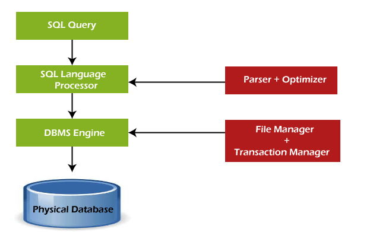
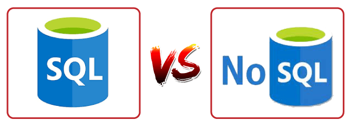

## SQL Tutorial

SQL tutorial provides basic and advanced concepts of SQL. Our SQL tutorial is designed for both beginners and professionals.

SQL (Structured Query Language) is used to perform operations on the records stored in the database, such as updating records, inserting records, deleting records, creating and modifying database tables, views, etc.

SQL is not a database system, but it is a query language.

Suppose you want to perform the queries of SQL language on the stored data in the database. You are required to install any database management system in your systems, for example, Oracle, MySQL, MongoDB, PostgreSQL, SQL Server, DB2, etc.

## What is SQL?

SQL is a short-form of the structured query language, and it is pronounced as S-Q-L or sometimes as See-Quell.

This database language is mainly designed for maintaining the data in relational database management systems. It is a special tool used by data professionals for handling structured data (data which is stored in the form of tables). It is also designed for stream processing in RDSMS.

You can easily create and manipulate the database, access and modify the table rows and columns, etc. This query language became the standard of ANSI in the year of 1986 and ISO in the year of 1987.

If you want to get a job in the field of data science, then it is the most important query language to learn. Big enterprises like Facebook, Instagram, and LinkedIn, use SQL for storing the data in the back-end.

## Why SQL?
Nowadays, SQL is widely used in data science and analytics. Following are the reasons which explain why it is widely used:

- The basic use of SQL for data professionals and SQL users is to insert, update, and delete the data from the relational database.
- SQL allows the data professionals and users to retrieve the data from the relational database management systems.
- It also helps them to describe the structured data.
- It allows SQL users to create, drop, and manipulate the database and its tables.
- It also helps in creating the view, stored procedure, and functions in the relational database.
- It allows you to define the data and modify that stored data in the relational database.
- It also allows SQL users to set the permissions or constraints on table columns, views, and stored procedures.

## History of SQL
"A Relational Model of Data for Large Shared Data Banks" was a paper which was published by the great computer scientist "E.F. Codd" in 1970.

The IBM researchers Raymond Boyce and Donald Chamberlin originally developed the SEQUEL (Structured English Query Language) after learning from the paper given by E.F. Codd. They both developed the SQL at the San Jose Research laboratory of IBM Corporation in 1970.

At the end of the 1970s, relational software Inc. developed their own first SQL using the concepts of E.F. Codd, Raymond Boyce, and Donald Chamberlin. This SQL was totally based on RDBMS. Relational Software Inc., which is now known as Oracle Corporation, introduced the Oracle V2 in June 1979, which is the first implementation of SQL language. This Oracle V2 version operates on VAX computers.

## Process of SQL
When we are executing the command of SQL on any Relational database management system, then the system automatically finds the best routine to carry out our request, and the SQL engine determines how to interpret that particular command.

Structured Query Language contains the following four components in its process:

- Query Dispatcher
- Optimization Engines
- Classic Query Engine
- SQL Query Engine, etc.

A classic query engine allows data professionals and users to maintain non-SQL queries. The architecture of SQL is shown in the following diagram:

## Some SQL Commands

The SQL commands help in creating and managing the database. The most common SQL commands which are highly used are mentioned below:

1. CREATE command
2. UPDATE command
3. DELETE command
4. SELECT command
5. DROP command
6. INSERT command

## CREATE Command

This command helps in creating the new database, new table, table view, and other objects of the database.

## UPDATE Command
This command helps in updating or changing the stored data in the database.

## DELETE Command
This command helps in removing or erasing the saved records from the database tables. It erases single or multiple tuples from the tables of the database.

## SELECT Command
This command helps in accessing the single or multiple rows from one or multiple tables of the database. We can also use this command with the WHERE clause.

## UPDATE Command
This command helps in updating or changing the stored data in the database.

## DELETE Command
This command helps in removing or erasing the saved records from the database tables. It erases single or multiple tuples from the tables of the database.

## SELECT Command
This command helps in accessing the single or multiple rows from one or multiple tables of the database. We can also use this command with the WHERE clause.

## DROP Command
This command helps in deleting the entire table, table view, and other objects from the database.

## INSERT Command
This command helps in inserting the data or records into the database tables. We can easily insert the records in single as well as multiple rows of the table.

## SQL vs No-SQL

The following table describes the differences between the SQL and NoSQL, which are necessary to understand:

| SQL	         | No-SQL       |
| :----------- | :----------- |
| 1. SQL is a relational database management system.	| 1. While No-SQL is a non-relational or distributed database management system. |
| 2. The query language used in this database system is a structured query language.	| 2. The query language used in the No-SQL database systems is a non-declarative query language. |
| 3. The schema of SQL databases is predefined, fixed, and static.	| 3. The schema of No-SQL databases is a dynamic schema for unstructured data. |
| 4. These databases are vertically scalable.	| 4. These databases are horizontally scalable. |
| 5. The database type of SQL is in the form of tables, i.e., in the form of rows and columns.	| 5. The database type of No-SQL is in the form of documents, key-value, and graphs. |
| 6. It follows the ACID model.	| 6. It follows the BASE model. |
| 7. Complex queries are easily managed in the SQL database.	| 7. NoSQL databases cannot handle complex queries. |
| 8. This database is not the best choice for storing hierarchical data.	| 8. While No-SQL database is a perfect option for storing hierarchical data. |
| 9. All SQL databases require object-relational mapping.	| 9. Many No-SQL databases do not require object-relational mapping. |
| 10. Gauges, CircleCI, Hootsuite, etc., are the top enterprises that are using this query language.	| 10. Airbnb, Uber, and Kickstarter are the top enterprises that are using this query language. |
| 11. SQLite, Ms-SQL, Oracle, PostgreSQL, and MySQL are examples of SQL database systems.	| 11. Redis, MongoDB, Hbase, BigTable, CouchDB, and Cassandra are examples of NoSQL database systems. |

## Advantages of SQL
SQL provides various advantages which make it more popular in the field of data science. It is a perfect query language which allows data professionals and users to communicate with the database. Following are the best advantages or benefits of Structured Query Language:

**1. No programming needed**

SQL does not require a large number of coding lines for managing the database systems. We can easily access and maintain the database by using simple SQL syntactical rules. These simple rules make the SQL user-friendly.

**2. High-Speed Query Processing**

A large amount of data is accessed quickly and efficiently from the database by using SQL queries. Insertion, deletion, and updation operations on data are also performed in less time.

**3. Standardized Language**

SQL follows the long-established standards of ISO and ANSI, which offer a uniform platform across the globe to all its users.

**4. Portability**

The structured query language can be easily used in desktop computers, laptops, tablets, and even smartphones. It can also be used with other applications according to the user's requirements.

**5. Interactive language**

We can easily learn and understand the SQL language. We can also use this language for communicating with the database because it is a simple query language. This language is also used for receiving the answers to complex queries in a few seconds.

**6. More than one Data View**

The SQL language also helps in making the multiple views of the database structure for the different database users.

## Disadvantages of SQL
With the advantages of SQL, it also has some disadvantages, which are as follows:

**1. Cost**

The operation cost of some SQL versions is high. That's why some programmers cannot use the Structured Query Language.

**2. Interface is Complex**

Another big disadvantage is that the interface of Structured query language is difficult, which makes it difficult for SQL users to use and manage it.

**3. Partial Database control**

The business rules are hidden. So, the data professionals and users who are using this query language cannot have full database control.
