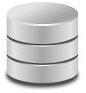
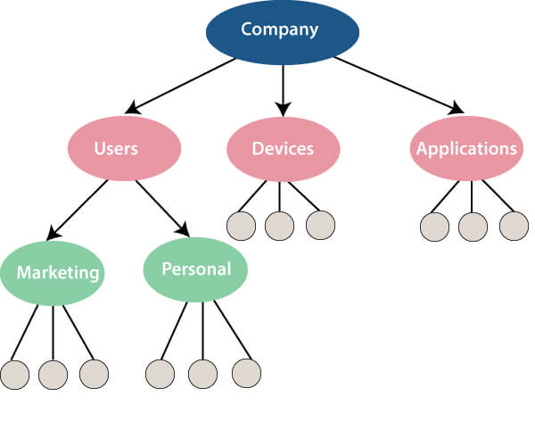
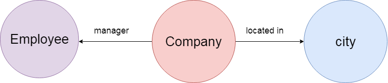

## What is Data? ##
Data is a collection of a distinct small unit of information. It can be used in a variety of forms like text, numbers, media, bytes, etc. it can be stored in pieces of paper or electronic memory, etc.

Word 'Data' is originated from the word 'datum' that means 'single piece of information.' It is plural of the word datum.

In computing, Data is information that can be translated into a form for efficient movement and processing. Data is interchangeable.

## What is Database? ##
A **database** is an organized collection of data, so that it can be easily accessed and managed.

You can organize data into tables, rows, columns, and index it to make it easier to find relevant information.

**Database handlers** create a database in such a way that only one set of software program provides access of data to all the users.

The **main purpose** of the database is to operate a large amount of information by storing, retrieving, and managing data.

There are many **dynamic websites** on the World Wide Web nowadays which are handled through databases. For example, a model that checks the availability of rooms in a hotel. It is an example of a dynamic website that uses a database.

There are many **databases available** like MySQL, Sybase, Oracle, MongoDB, Informix, PostgreSQL, SQL Server, etc.

Modern databases are managed by the database management system (DBMS).

**SQL** or Structured Query Language is used to operate on the data stored in a database. SQL depends on relational algebra and tuple relational calculus.

A cylindrical structure is used to display the image of a database.

>Photo by : <a href ="https://www.javatpoint.com/what-is-database">Java T Point </a>.

## Evolution of Databases ##
The database has completed more than 50 years of journey of its evolution from flat-file system to relational and objects relational systems. It has gone through several generations.

## The Evolution ##

##### File-Based #####
1968 was the year when File-Based database were introduced. In file-based databases, data was maintained in a flat file. Though files have many advantages, there are several limitations.

One of the major advantages is that the file system has various access methods, e.g., sequential, indexed, and random.

It requires extensive programming in a third-generation language such as COBOL, BASIC.

##### Hierarchical Data Model #####
1968-1980 was the era of the Hierarchical Database. Prominent hierarchical database model was IBM's first DBMS. It was called IMS (Information Management System).

In this model, files are related in a parent/child manner.

Below diagram represents Hierarchical Data Model. Small circle represents objects.

>Photo by : <a href ="https://www.javatpoint.com/what-is-database">Java T Point </a>

Like file system, this model also had some limitations like complex implementation, lack structural independence, can't easily handle a many-many relationship, etc.

### Network data model ###
**Charles Bachman** developed the first DBMS at Honeywell called Integrated Data Store (IDS). It was developed in the early 1960s, but it was standardized in 1971 by the CODASYL group (Conference on Data Systems Languages).

In this model, files are related as owners and members, like to the common network model.

**Network data model identified the following components:**

- Network schema (Database organization)
- Sub-schema (views of database per user)
- Data management language (procedural)

This model also had some limitations like system complexity and difficult to design and maintain.

##### Relational Database #####

**1970 - Present:** It is the era of Relational Database and Database Management. In 1970, the relational model was proposed by E.F. Codd.

Relational database model has two main terminologies called instance and schema.

The instance is a table with rows or columns

Schema specifies the structure like name of the relation, type of each column and name.

This model uses some mathematical concept like set theory and predicate logic.

The first internet database application had been created in 1995.

During the era of the relational database, many more models had introduced like object-oriented model, object-relational model, etc.

### Cloud database ###

Cloud database facilitates you to store, manage, and retrieve their structured, unstructured data via a cloud platform. This data is accessible over the Internet. Cloud databases are also called a database as service (DBaaS) because they are offered as a managed service.

**Some best cloud options are:**

- AWS (Amazon Web Services)
- Snowflake Computing
- Oracle Database Cloud Services
- Microsoft SQL server
- Google cloud spanner

**Advantages of cloud database**

**Lower costs**

Generally, company provider does not have to invest in databases. It can maintain and support one or more data centers.

**Automated**

Cloud databases are enriched with a variety of automated processes such as recovery, failover, and auto-scaling.

**Increased accessibility**

You can access your cloud-based database from any location, anytime. All you need is just an internet connection.

## NoSQL Database ##

A NoSQL database is an approach to design such databases that can accommodate a wide variety of data models. NoSQL stands for "not only SQL." It is an alternative to traditional relational databases in which data is placed in tables, and data schema is perfectly designed before the database is built.

NoSQL databases are useful for a large set of distributed data.

Some examples of NoSQL database system with their category are:

- MongoDB, CouchDB, Cloudant (Document-based)
- Memcached, Redis, Coherence (key-value store)
- HBase, Big Table, Accumulo (Tabular)

### Advantage of NoSQL ###

**High Scalability**

NoSQL can handle an extensive amount of data because of scalability. If the data grows, NoSQL database scale it to handle that data in an efficient manner.

**High Availability**

NoSQL supports auto replication. Auto replication makes it highly available because, in case of any failure, data replicates itself to the previous consistent state.

### Disadvantage of NoSQL ###

**Open source**

NoSQL is an open-source database, so there is no reliable standard for NoSQL yet.

**Management challenge**

Data management in NoSQL is much more complicated than relational databases. It is very challenging to install and even more hectic to manage daily.

**GUI is not available**

GUI tools for NoSQL database are not easily available in the market.

**Backup**

Backup is a great weak point for NoSQL databases. Some databases, like MongoDB, have no powerful approaches for data backup.

## The Object-Oriented Databases ##

The object-oriented databases contain data in the form of object and classes. Objects are the real-world entity, and types are the collection of objects. An object-oriented database is a combination of relational model features with objects oriented principles. It is an alternative implementation to that of the relational model.

Object-oriented databases hold the rules of object-oriented programming. An object-oriented database management system is a hybrid application.

The object-oriented database model contains the following properties.

**Object-oriented programming properties**

- Objects
- Classes
- Inheritance
- Polymorphism
- Encapsulation

**Relational database properties**

- Atomicity
- Consistency
- Integrity
- Durability
- Concurrency
- Query processing

## Graph Databases ##

A graph database is a NoSQL database. It is a graphical representation of data. It contains nodes and edges. A node represents an entity, and each edge represents a relationship between two edges. Every node in a graph database represents a unique identifier.

Graph databases are beneficial for searching the relationship between data because they highlight the relationship between relevant data.

>Photo by : <a href ="https://www.javatpoint.com/what-is-database">Java T Point </a>

Graph databases are very useful when the database contains a complex relationship and dynamic schema.

It is mostly used in **supply chain management**, identifying the source of **IP telephony**.

## DBMS (Data Base Management System) ##

Database management System is software which is used to store and retrieve the database. For example, Oracle, MySQL, etc.; these are some popular DBMS tools.

- DBMS provides the interface to perform the various operations like creation, deletion, modification, etc.
- DBMS allows the user to create their databases as per their requirement.
- DBMS accepts the request from the application and provides specific data through the operating system.
- DBMS contains the group of programs which acts according to the user instruction.
- It provides security to the database.

## Advantage of DBMS ##

**Controls redundancy**

It stores all the data in a single database file, so it can control data redundancy.

**Data sharing**

An authorized user can share the data among multiple users.

**Backup**

It providesBackup and recovery subsystem. This recovery system creates automatic data from system failure and restores data if required.

**Multiple user interfaces**

It provides a different type of user interfaces like GUI, application interfaces.

## Disadvantage of DBMS ##

**Size**

It occupies large disk space and large memory to run efficiently.

**Cost**

DBMS requires a high-speed data processor and larger memory to run DBMS software, so it is costly.

**Complexity**

DBMS creates additional complexity and requirements.

## RDBMS (Relational Database Management System) ##

The word RDBMS is termed as 'Relational Database Management System.' It is represented as a table that contains rows and column.

RDBMS is based on the Relational model; it was introduced by E. F. Codd.

**A relational database contains the following components:**

- Table
- Record/ Tuple
- Field/Column name /Attribute
- Instance
- Schema
- Keys

An RDBMS is a tabular DBMS that maintains the security, integrity, accuracy, and consistency of the data.
